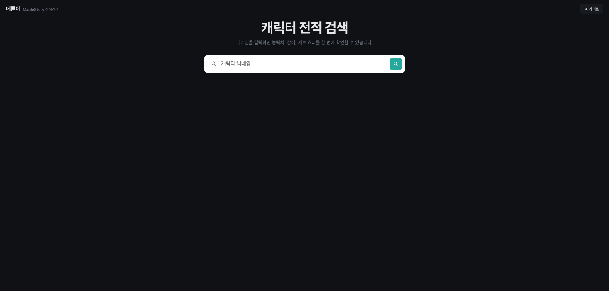
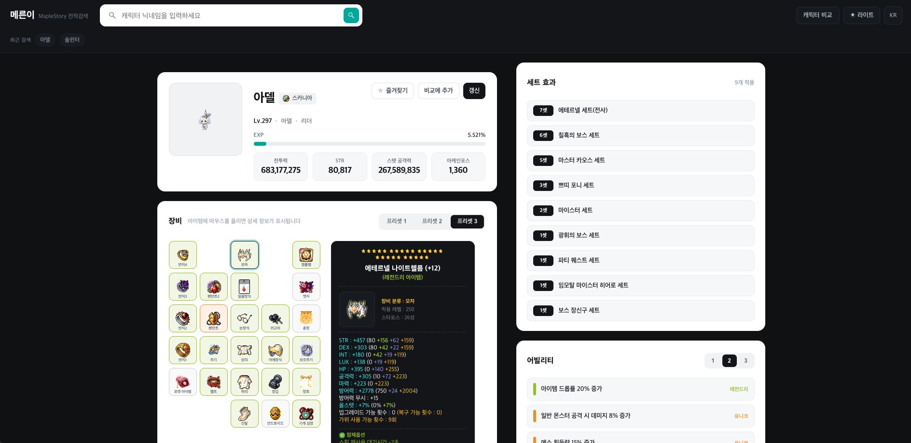
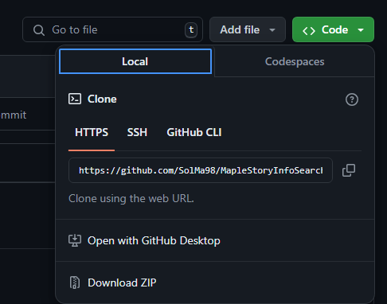

# Mereni (메른이)
Nexon OPEN API, REACT를 활용해서 개발한 MapleStory 캐릭터 검색 사이트

## 프로젝트 소개
MapleStory 캐릭터를 검색하고 캐릭터의 능력치, 장비 아이템, 세트 효과, 어빌리티, 최근 7일 경험치 변화를 확인 할 수 있습니다.
캐릭터 비교, 즐겨찾기·최근 검색, 다크/라이트 테마를 지원합니다.

### 프로젝트 이미지
[메인 페이지]

[검색 결과 페이지]

### 프로젝트 다운로드 방법
1.Git hub url 접속

URL : https://github.com/SolMa98/MapleStoryInfoSearch

2.Clone Http 주소 복사

3.CMD에서 원하는 디렉터리에 위치

git clone {복사한 url}